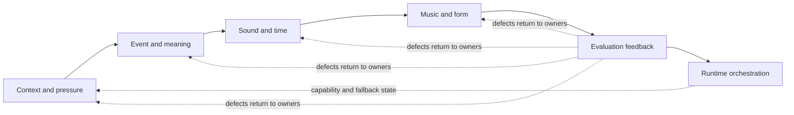

# Advanced Lyricism

Agentic Eminem pretty much. Lyric writing, rewriting, beat mapping, and revision when a task needs explicit text, MIDI, or audio representations. It is a Python-backed agent skill that carries artifacts through a 15-domain composition graph and six layers. Unavailable measurements stay `null` or unknown; the route preserves the writer's subject, voice, pronunciation, register, emotional logic, supplied material, and hard constraints.

[](skills/advanced-lyricism/assets/domain-registry.json) [](skills/advanced-lyricism/SKILL.md) [](skills/advanced-lyricism/assets/tool-catalog.json) [](skills/advanced-lyricism/scripts/)


## Contents

- [Why this exists](#why-this-exists)
- [What the skill provides](#what-the-skill-provides)
- [Install](#install)
- [Quickstart](#quickstart)
- [Routes](#routes)
- [The source-driven composition graph](#the-source-driven-composition-graph)
- [Tools and safe interpretation](#tools-and-safe-interpretation)
- [Known limitations and capability states](#known-limitations-and-capability-states)
- [Supplied audio, MIDI, and beat material](#supplied-audio-midi-and-beat-material)
- [Concrete examples](#concrete-examples)
- [Validation](#validation)
- [References](#references)
- [Contributing](#contributing)
- [Licence](#licence)
- [Security](#security)
- [Support](#support)

## Why this exists

Lyric routes often lose intent when meaning, sound, timing, beat, delivery, and revision are handled as separate prompts. This skill keeps those decisions connected through named artifacts and sends defects back to every owning domain. It exists to make the handoffs inspectable while leaving artistic selection and audition with the writer.

## What the skill provides

- A directed composition graph spanning context research, concept architecture, lexical engineering, rhyme and phonology, prosody and flow, musical representation, performance delivery, narrative scene, rhetoric and impact, voice and register, hook and song form, genre and beat fit, revision evaluation, creative operations, and runtime orchestration.
- Local Python tools, each with a declared input, output, capability state, fallback, and primary reference/template pair.
- Named pipelines for compound writing, drill-aware scene construction, beat-locked work, hooks, revision, MIDI/audio timing, controlled ideation, and explicit full-catalog sweeps.
- Paired deep references and working templates, structured JSON schemas, beat profiles, a bundled pronunciation dictionary, and a bundled MIDI parser.
- Capability-aware routing through `scripts/tool_router.py`: `full`, `partial`, and `blocked` remain separate states. An unavailable measurement stays `null` or explicitly unavailable; it is never converted into a negative craft result.

The local tools provide observations, representations, candidates, transformations, and diagnostics. They support audition and judgement. They do not establish artistic quality, perceived groove, vocal feasibility, or the fit of a performance nobody has heard. Inspect the [activation contract](skills/advanced-lyricism/SKILL.md).

### Route comparison

The table compares three named pipelines from `skills/advanced-lyricism/assets/tool-catalog.json`. Counts are structural: `domains` is the array length, `steps` includes every declared step, `decision points` counts `decision_point` entries, and `audition stages` counts `audition` entries. They describe route shape, not speed or artistic quality.

| Pipeline | Domains | Declared steps | Decision points | Audition stages | Use when |
| --- | ---: | ---: | ---: | ---: | --- |
| `lyric_compound` | 15 | 9 | 1 | 1 | The lyric needs the full meaning, sound, music, performance, and evaluation graph |
| `beat_locked_compound` | 12 | 6 | 0 | 1 | Supplied beat material must stay authoritative while wording and delivery develop |
| `revision_compound` | 14 | 8 | 1 | 1 | An existing draft needs baseline, targeted diagnostics, coordinated repair, and recheck |

Local timing sample (not a throughput benchmark): `tool_router.py --pipeline lyric_compound` ran five serial times on Python 3.12.10 and Windows 11 on an HP EliteBook 645 14 inch G9 Notebook PC, using a Python `perf_counter` wrapper, one process/concurrency, and 1,198.25 ms total measured wall duration. Mean time was 239.65 ms; p50 was 241.11 ms; all five return codes were 0. This is an environment-specific route-planning observation, not a cross-machine performance claim; rerun it on the target host before comparing changes.


## Install

**Requirements:** Node.js 22 was the CI-tested runtime for the `skills` CLI; Python 3.12.10 was the local validation runtime. The repository does not declare a lower version floor yet. Git is required for the repository checkout below. The documented commands are intended for Windows, macOS, or Linux environments with Node.js, Python, and a shell that can run the shown commands; CI currently runs on Ubuntu.

Install from a current repository checkout. Use your normal GitHub credentials if the repository is access-controlled:

```bash
git clone https://github.com/povvo/advanced-lyricism.git
cd advanced-lyricism
npx skills add . --list
npx skills add . --skill advanced-lyricism --agent codex --copy --yes
```

Expected discovery includes:

```text
advanced-lyricism
```

For a reproducible source state, optionally pin that checkout to a reviewed commit before installing locally:

```bash
git fetch --prune origin
git checkout <reviewed-commit>
npx skills add . --skill advanced-lyricism --agent codex --copy --yes
```

Audio feature conversion is optional and currently conditional on the `audio_analysis` capability. Text and MIDI routes use the bundled assets; PCM WAV coarse energy has a dependency-free fallback. No system compiler is required by the documented text-first path. See the [dependency manifest](skills/advanced-lyricism/assets/dependency-manifest.json).
## Quickstart

From the repository checkout (the directory that contains `skills/`), run this source-driven, text-first route first. Four commands create a small input, check capabilities, select the general composition route, and run the bundled pronunciation map.

### First route

```bash
python -c "from pathlib import Path; Path('build').mkdir(exist_ok=True); Path('build/lyrics.txt').write_text('Rain on the estate, I count what I can keep.\nNight bus turns the corner, same name, new street.\n', encoding='utf-8')"
python skills/advanced-lyricism/scripts/dependency_check.py
python skills/advanced-lyricism/scripts/tool_router.py --pipeline lyric_compound
python skills/advanced-lyricism/scripts/phoneme_map.py -i build/lyrics.txt --summary
```

**Expected output:** the preflight returns the `advanced-lyricism.runtime-capabilities.v1` schema, the route plan returns `"ok": true` with `"pipeline": "lyric_compound"`, and the pronunciation summary reports `"state": "full"` with bundled CMUdict coverage for the sample tokens. These are mechanical observations; they do not decide whether the lyric works when performed.


1. **Write the brief.** Record the speaker, subject, contradiction, scene, intended audience, pronunciation or register requirements, section, beat information, supplied material, exclusions, and what must remain locked. Keep the writer's own words ahead of genre priors.

2. **Inspect capabilities before choosing tools.** From the repository root, run:

   ```bash
   python skills/advanced-lyricism/scripts/dependency_check.py
   python skills/advanced-lyricism/scripts/tool_router.py --pipeline lyric_compound
   ```

   The first command reports providers and capability states. The second prints the selected route and its safe claims. A successful preflight is a plan; it is not a claim that a lyric has improved.

3. **Choose the pipeline from the task.** Use `lyric_compound` for a general draft or rewrite, `beat_locked_compound` when supplied beat material must stay authoritative, `hook_compound` when return identity and changed meaning are central, `revision_compound` for a full draft revision, or `narrative_drill_compound` when causal drill scene construction is itself central. A genre word by itself does not choose the graph.

4. **Represent supplied material.** For a MIDI file, preserve event timing with:

   ```bash
   python skills/advanced-lyricism/scripts/tool_router.py --tool midi_to_json
   python skills/advanced-lyricism/scripts/midi_to_json.py beat.mid -o build/beat.json
   python skills/advanced-lyricism/scripts/music_structure.py build/beat.json -o build/structure.json
   ```

   For a PCM WAV, a dependency-free coarse energy route is:

   ```bash
   python skills/advanced-lyricism/scripts/tool_router.py --tool wav_energy_probe
   python skills/advanced-lyricism/scripts/wav_energy_probe.py beat.wav -o build/wav-energy.json
   ```

   `audio_to_json.py` is a separate estimated tempo/beat/onset/energy route. It is available only when the `audio_analysis` capability is full. If it is blocked, retain supplied BPM and section timing or use the WAV-energy representation; do not invent a tempo, key, harmony, or instrument identity.

5. **Build and inspect the lyric.** Carry the brief and representations through the selected pipeline. For text-only work, a compact first inspection can be:

   ```bash
   python skills/advanced-lyricism/scripts/phoneme_map.py -i lyrics.txt --summary
   python skills/advanced-lyricism/scripts/prosody_map.py -i lyrics.txt --bpm 140 -o build/prosody.json
   python skills/advanced-lyricism/scripts/rhyme_grid.py -i lyrics.txt -o build/rhyme.json
   ```

   Use a pronunciation override when the supplied pronunciation outranks dictionary coverage. Treat uncovered words and heuristic syllable counts as uncertainty, not evidence of a failed line.

6. **Audition and revise.** Compare meaning, voice, heard sound, stress, breath, beat space, section movement, and performance. Route a defect back to every domain that owns it, then rerun invalidated downstream checks. A useful revision loop is:

   ```bash
   python skills/advanced-lyricism/scripts/tool_router.py --pipeline revision_compound
   python skills/advanced-lyricism/scripts/craft_audit.py -i lyrics.txt -o build/craft-audit.json
   python skills/advanced-lyricism/scripts/workbench.py --help
   ```

   `craft_audit.py` establishes a mechanical baseline; it does not decide which repair survives audition.

7. **Verify the repository and the install surface.** Run the structural and runtime checks described in [Validation](#validation), then inspect the exact diff before committing.

## Routes

Choose a route from the task, its available input, and the output you need. A route carries artifacts; it is not a quality grade.

| Pipeline | Use it when | Main evidence or handoff |
| --- | --- | --- |
| `lyric_compound` | Building or rewriting a lyric across the applicable craft layers | brief, scene, semantic fields, sound/time, music/form, evaluation |
| `narrative_drill_compound` | Causal drill scene construction is central | context, speaker pressure, causal scene, drill-aware beat and delivery constraints |
| `beat_locked_compound` | Supplied audio, MIDI, or beat data must constrain wording and delivery | raw-preserving beat representation, meaning-led language, cadence, delivery, form |
| `hook_compound` | A hook needs identity, memory, changed return meaning, contrast, and performability | identity, phrase field, return architecture, sound/delivery, evaluation |
| `revision_compound` | A complete draft needs baseline, targeted diagnostics, coordinated repair, and recheck | component-preserving baseline, defect map, owning domains, confirmation |
| `revision_targeted` | A smaller targeted revision is appropriate | targeted detectors followed by optional aggregate confirmation |
| `midi_to_verse` | Timing should be planned from MIDI while raw events remain visible | MIDI event IR, structure, beat affordance, prosody, delivery |
| `audio_to_verse` | Supplied audio should influence timing and energy decisions | audio IR when available, or explicit fallback to supported WAV/metadata observations |
| `controlled_ideation` | Alternatives need reproducible variation and separate selection | generated candidates, semantic/preference filters, selected path |
| `script_sweep` | The user explicitly asks to inspect or run the full catalog | applicability plan and outputs for every supported operation |

Preflight any individual route or tool:

```bash
python skills/advanced-lyricism/scripts/tool_router.py --list
python skills/advanced-lyricism/scripts/tool_router.py --tool phoneme_map
python skills/advanced-lyricism/scripts/tool_router.py --tool lexical_cloud --uses png,stem
```

An individual tool can be `blocked` even when its fallback or a neighbouring tool is available. Preserve that distinction in the working notes. Use the [tool router](skills/advanced-lyricism/scripts/tool_router.py) for the current contract.

## The source-driven composition graph

The graph has six practical layers. Each layer produces named artifacts for the next layer, while evaluation sends defects back to every owner.

| Layer | Questions | Artifacts passed forward |
| --- | --- | --- |
| Context and pressure | Who speaks, what is at stake, what is changing, and what is excluded? | grounded brief, speaker model, contradiction, relationships |
| Event and meaning | What happens, in what causal order, and what must each turn change? | scene graph, semantic fields, rhetorical turns, controlled variants |
| Sound and time | What is heard, stressed, breathed, repeated, suspended, or physically awkward? | phoneme map, rhyme network, prosody map, cadence and rehearsal plan |
| Music and form | What does the supplied beat or section structure actually provide? | event/energy representation, structure cues, beat affordances, return logic |
| Evaluation feedback | Which supported defects interact, and which domains own them? | baseline, defect map, comparison, accepted revision set |
| Runtime orchestration | What can run here, with which dependencies and output contract? | capability state, ordered plan, fallbacks, output paths |

The canonical domain graph and paired resources are defined in `skills/advanced-lyricism/assets/domain-registry.json`, `assets/composition-matrix.md`, and `assets/reference-template-index.md`. The agent-facing activation, constraints, examples, and route names live in `skills/advanced-lyricism/SKILL.md`.



The diagram is a reader map, not a performance score; the source registries and runtime validators remain authoritative.

## Tools and safe interpretation

Use each tool's declared input and safe claims to decide whether it can assist the task.

| Class | Tools | What they contribute |
| --- | --- | --- |
| Representation | `midi_to_json`, `audio_to_json`, `phoneme_map`, `delivery_notation`, `beat_profile_summary`, `wav_energy_probe`, `scene_graph` | Preserve or expose supplied timing, pronunciation, notation, profiles, coarse WAV energy, or relationships |
| Detection | `music_structure`, `beat_affordance`, `prosody_map`, `technique_opportunity`, `articulation_audit`, `rhyme_grid`, `lexical_cloud`, `beat_metadata_reconcile`, `semantic_field_map`, `preference_profile` | Produce localized observations from valid inputs |
| Generation | `rhyme_suggester`, `idea_lab`, `arc_generator`, `cadence_lab`, `context_query_plan` | Produce candidates or planning material that still requires selection |
| Transform | `word_rearranger` | Try controlled wording/order variants without replacing evaluation |
| Evaluation | `craft_audit`, `workbench` | Establish a broad baseline or aggregate component findings |
| Capability control | `dependency_check`, `tool_router` | Report providers, preflight routes, and preserve full/partial/blocked states |

Important boundaries:

- `phoneme_map` can always tokenize and estimate syllables, but phoneme and stress claims depend on coverage. Uncovered words need explicit pronunciation handling.
- `prosody_map` always reports supported density observations; stress-grid claims require the reported lexical-stress coverage.
- `audio_to_json` reports estimates only when its audio backend is available. It does not identify a key, harmony, instruments, or what a vocalist will feel.
- `wav_energy_probe` reads PCM WAV data for energy, section changes, and coarse pulse cues. Half-time versus double-time remains unresolved from that cue alone.
- `midi_to_json` preserves MIDI events, ticks, tempo, meter, and key events when present. It is a representation, not a performance judgement.
- `lexical_cloud --uses png` and `--uses stem` require their optional providers. Lexical JSON may remain usable while image rendering or stemming is blocked.
- `rhyme_suggester`, `idea_lab`, `arc_generator`, `cadence_lab`, and `word_rearranger` create candidates. Selection stays separate and must respect the brief, voice, meaning, and audition.

## Known limitations and capability states

Python is required for the local toolchain. Core text routes use the standard library and bundled assets. Optional providers are declared in `skills/advanced-lyricism/assets/dependency-manifest.json`.

| Capability | Provider | Effect when absent |
| --- | --- | --- |
| `pronunciation_dictionary` | bundled CMUdict or `cmudict` | Phoneme/stress coverage is partial; heuristic tokenization and syllable counts can still be reported |
| `midi_parse` | bundled `mido` or installed `mido` | MIDI conversion is blocked; use supplied timing or another supported representation |
| `audio_analysis` | `numpy` and `librosa` | `audio_to_json` is blocked; preserve supplied BPM/sections or use supported WAV-energy/manual observations |
| `audio_decode` | `soundfile` | Use the route's supported decoder/fallback; do not claim decoded features that were not produced |
| `wordcloud_png` | `wordcloud` | PNG output is blocked; lexical JSON and other text profiling can remain available |
| `porter_stemming` | `nltk` | Stemming mode is blocked; ordinary lexical profiling can remain available |

Check before execution:

```bash
python skills/advanced-lyricism/scripts/dependency_check.py
python skills/advanced-lyricism/scripts/dependency_check.py --required audio_analysis
```

The required-capability form deliberately exits non-zero when the requested optional capability is missing. That is a useful stop signal, not a failed artistic measurement. See the [dependency manifest](skills/advanced-lyricism/assets/dependency-manifest.json) for provider contracts.

## Supplied audio, MIDI, and beat material

Supplied material is authoritative input for the task, but each format exposes different evidence:

- **MIDI:** parse locally with `midi_to_json.py`; retain raw ticks and derived seconds/metric coordinates. Then inspect structure and candidate lyric stress/space relationships. MIDI contains symbolic events, not the performed feel of a recording.
- **Audio:** use `audio_to_json.py` only after `tool_router.py` reports `audio_analysis` as available. Treat tempo, onset, beat, and energy values as estimates. If unavailable, keep the original BPM/section metadata or use `wav_energy_probe.py` for supported coarse observations.
- **PCM WAV:** `wav_energy_probe.py` can expose energy changes and a coarse pulse without the full audio backend. It does not settle half-time/double-time, key, harmony, instrument identity, or vocal feasibility.
- **Beat profiles and metadata:** `beats/` fixtures can seed a route; `beat_metadata_reconcile.py` compares metadata claims with available analysis. A metadata label remains a claim to reconcile, not a measurement.

Do not imply that a script listened to a recording when it only read metadata, energy windows, or symbolic events. Preserve raw observations, derived coordinates, interpretations, and human audition as separate notes. The [user guide](docs/user-guide.md) shows the supplied-media recovery path.

## Concrete examples

These are original examples of how to select a route; they are not bundled outputs or claims about a user's voice.

### A meaning-led 16-bar draft

Brief: “Write 16 bars about missing the last train while pretending the delay was deliberate. Keep the speaker dry, avoid generic crime imagery, and let the hook change meaning after the second verse.”

Use `lyric_compound`. Start with a context/pressure brief and a scene sequence, then let semantic fields and rhetorical turns produce the tension. Use `hook_compound` as an added route if the return phrase is the main design problem. A line such as “I kept the ticket warm, called the timetable cold” is a candidate for audition, not an automatic recommendation.

### A beat-locked verse from MIDI

Brief: “Keep the supplied MIDI's bar timing authoritative. The verse should leave a deliberate gap before the last landing of each bar.”

Use `beat_locked_compound` or the narrower `midi_to_verse` route. Run `midi_to_json`, `music_structure`, `beat_affordance`, `prosody_map`, and `delivery_notation`; keep the raw event timing alongside any bar/beat coordinates. Select wording only after checking that the gap survives pronunciation and performance.

### A revision with a physical delivery problem

Brief: “The concept works, but bars 5–8 stumble when spoken at the intended tempo.”

Use `revision_compound` if the whole draft needs rechecking. Use `revision_targeted` if the defect is bounded. Establish a `craft_audit` baseline, inspect `articulation_audit`, `prosody_map`, `rhyme_grid`, and `delivery_notation`, route the defect to lexical/prosody/performance owners, try controlled rearrangements or cadence variants, and re-audition the repaired section. Keep any other dimension explicitly locked while testing the change.

## Repository layout

```text
.
├── README.md
├── docs/
│   ├── contributor-guide.md
│   └── user-guide.md
├── skills/advanced-lyricism/
│   ├── SKILL.md
│   ├── agents/openai.yaml
│   ├── assets/
│   │   ├── composition-matrix.md
│   │   ├── dependency-manifest.json
│   │   ├── domain-registry.json
│   │   ├── reference-template-index.md
│   │   ├── schemas/
│   │   ├── templates/
│   │   └── phonology/
│   ├── beats/
│   ├── references/
│   └── scripts/
└── .github/
    ├── scripts/validate-skill.mjs
    └── workflows/validate-skills.yml
```

The resource index maps each reference to its paired template and tool. The schemas define interchange formats for audio events, beat metadata reconciliation, context queries, delivery, MIDI events, phonemes, preferences, scenes, semantic fields, technique opportunities, and WAV energy. The `scripts/vendor/mido/` tree is bundled support for local MIDI parsing and retains its upstream license.

## Validation

Run from the repository root:

```bash
node .github/scripts/validate-skill.mjs skills
python skills/advanced-lyricism/scripts/validate_skill.py skills/advanced-lyricism
python skills/advanced-lyricism/scripts/validate_domain_architecture.py
python skills/advanced-lyricism/scripts/validate_runtime_contracts.py
DISABLE_TELEMETRY=1 npx --yes skills@latest add . --list
```

The validators cover skill structure, architecture counts and links, runtime capability contracts, local CLI discovery, and the copied-install surface. The GitHub workflow repeats structural validation, CLI discovery, and an isolated copied install on pushes to `main`, pull requests, manual dispatches, and its scheduled compatibility run. Local success is evidence for the local checkout; the remote workflow remains a separate release check.

Before a change is committed, also run:

```bash
git diff --check
git status --short
```

Inspect generated or ignored cache files separately from the tracked diff. Do not use a cache artifact as evidence that a tool's advertised output was produced. Read the [validation workflow](.github/workflows/validate-skills.yml) for the remote checks.


## Troubleshooting and recovery

Use the first failing condition to choose a recovery path; keep the command output with the session record.

| Symptom | Check first | Recovery and success criterion |
| --- | --- | --- |
| `npx skills add` cannot list `advanced-lyricism` | Run the command from a shell with Node.js 22 and access to the source | Confirm the list contains `advanced-lyricism`; if access still fails, capture the CLI error and use the pinned local checkout path. |
| A route reports `blocked` or a required-capability check exits non-zero | Run `python skills/advanced-lyricism/scripts/dependency_check.py` and inspect the named capability | Keep the state `blocked` or `unknown`; use the documented MIDI/WAV/manual fallback and do not replace missing values with zeros. |
| `audio_to_json.py` cannot run | Check whether `audio_analysis` is `full` | Keep supplied BPM/section timing or run `wav_energy_probe.py` for supported PCM WAV cues; success means a supported fallback artifact exists, not that key or harmony was inferred. |
| A validator fails after a source change | Re-run the failing validator from the repository root and read the first reported path | Repair the source contract and its paired reference/template/schema, then rerun the architecture, runtime, and structural checks; do not treat an ignored cache file as proof. |
| A generated lyric or revision does not survive audition | Compare the brief, voice, meaning, pronunciation, timing, breath, beat space, and delivery evidence | Route the defect to every owning domain, rerun invalidated downstream checks, and retain only a repair that survives human audition. |

If the same source-backed failure remains after the relevant fallback and validator rerun, stop and open a reproducible issue with the command, exit code, input representation, output path, and environment. Do not claim a route succeeded because a plan or preflight returned successfully.

## References

- [Skills CLI on npm](https://www.npmjs.com/package/skills) — the package registry page for the `npx skills` discovery and installation command. Advanced Lyricism itself is not published as an npm package.
- [MIDI 1.0 Core Specifications](https://midi.org/midi-1-0-core-specifications) — the official MIDI Association specification context for the symbolic event data retained by the MIDI route.
- [Mido documentation](https://mido.readthedocs.io/en/latest/) — a related Python MIDI tool; this repository uses a bundled parser path and records `midi_parse` capability state before routing.
- [GitHub Actions documentation](https://docs.github.com/en/actions) — the integration guide for the workflow that runs structural validation, discovery, and copied-install checks.
- [Python documentation](https://docs.python.org/3/) — the runtime reference for the local scripts and standard-library text routes.
- [CMUSphinx CMUdict](https://github.com/cmusphinx/cmudict) — the upstream pronunciation-dictionary project corresponding to the bundled CMUdict asset and its separate licence file.

These links provide standards, related-tool, integration, runtime, and package-registry context. The repository's own registries, scripts, validators, and manuals remain the authoritative route contract; see [Validation](#validation), [the user guide](docs/user-guide.md), and [the contributor guide](docs/contributor-guide.md).

## Contributing

```bash
git clone https://github.com/povvo/advanced-lyricism.git
cd advanced-lyricism
python skills/advanced-lyricism/scripts/dependency_check.py
python skills/advanced-lyricism/scripts/validate_domain_architecture.py && python skills/advanced-lyricism/scripts/validate_runtime_contracts.py
```

Bug reports, documentation improvements, source-backed route changes, and validator fixes are welcome. Read [CONTRIBUTING.md](CONTRIBUTING.md) and the detailed [contributor guide](docs/contributor-guide.md) before changing a tool, domain, pipeline, schema, reference, template, dependency, or fallback.

## Licence

No project-level SPDX licence has been selected for the original Advanced Lyricism material. Until one is selected, reuse and redistribution rights remain restricted by default. Bundled third-party material keeps its own terms: [CMU Pronouncing Dictionary license](skills/advanced-lyricism/assets/phonology/CMUDICT-LICENSE.txt) and [Mido license](skills/advanced-lyricism/scripts/vendor/MIDO-LICENSE.txt).

## Security

Report vulnerabilities privately to [povvo.dev@gmail.com](mailto:povvo.dev@gmail.com); do not use public issues, pull requests, or discussions for sensitive details. See [SECURITY.md](SECURITY.md) for repository reporting details and the [account security policy](https://github.com/povvo/.github/blob/main/SECURITY.md) for response timing and account-wide handling.

## Support

Questions and route-selection discussions can use [GitHub Discussions](https://github.com/povvo/advanced-lyricism/discussions) when enabled; reproducible bugs and documentation corrections can use [GitHub Issues](https://github.com/povvo/advanced-lyricism/issues). The [user guide](docs/user-guide.md) covers first runs and recovery, while the [contributor guide](docs/contributor-guide.md) covers addition and maintenance paths.


