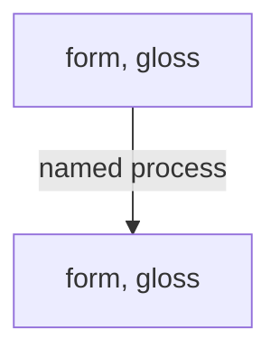

# Lexical Engineering — Working Template

> Method: `references/lexical-engineering.md`
> Fill every field relevant to the task. Leave genuinely unknown details blank.
> Tool outputs expose patterns for audition; they do not select edits.

## Decision
- craft objectives / questions:
- section / lines:
- user constraints to preserve:
- supplied creative material:
- uncertainty that matters:
- current hypotheses:
- success conditions:

## Working variables
- concrete nouns:
- active verbs:
- sensory properties:
- procedural vocabulary:
- institutional language:
- technical terms:
- local register:
- semantic anchors:
- polysemy:
- word history:
- morphology:
- sound family:
- stress contour:
- motif vocabulary:
- counter-field vocabulary:
- consequence words:

## Semantic-field map
- preset / custom fields:
- dominant fields:
- fields changing across the section:
- cross-field collisions:
- repeated unmapped terms:
- field to strengthen / thin / redirect:

## Domain workspace

- target word:
- current sense:
- proposed older / alternate sense:
- source / verification:
- inherited / borrowed / uncertain:
- language layer and diagnostic indicators:
- competing/polygenetic route:
- productive English morphology or structure inherited inside a loan:
- cranberry/opaque material:
- semantic-change type:
- relevant sound development and supported correspondence:
- intermediate forms / senses:
- cognate or learned-borrowing branches:
- competing hypotheses:
- uncertainty:
- lyric payoff:
- does the modern surface meaning work without the history?:

## Derivation sketch
`source -> change -> intermediate -> modern -> lyric use`

- layout: `graph TD` single chain / `graph LR` comparison or travelling borrowing
- reconstructed nodes marked `*`:
- attestation dates present where known:
- established steps solid / uncertain hypotheses dotted:
- edge labels name the actual change or route:

---

- anchor word / phrase:
- meaning in song:
- pronunciation as performed:
- stressed syllable:
- stressed vowel / acoustic pivot:
- coda:
- stress contour:
- intended beat position:

## Candidate families
### Close / exact
-

### Tail-varied slants
-

### Vowel-preserving
-

### Articulatory / consonant-family
-

### Consonance
-

### Mosaic / phrase
-

### Same stress contour
-

## Semantic filters
- scene:
- action:
- consequence:
- motif:
- domain-specific:
- legitimate second reading:

## Performance filter
- syllable count:
- consonant congestion:
- vowel length:
- breath:
- local pronunciation:

## Reject / demote
- predictable suffix-only:
- forced syntax:
- wrong accent:
- weak meaning:
- annotation-dependent:

## Tool route
- planner command: `python scripts/tool_router.py --tool <id>`
- preflight state: full / partial / blocked
- available outputs:
- unavailable outputs in partial mode:
- missing capability / fallback:
- tool id:
- why this tool can change the decision:
- input:
- seed / locked variables, if generative:
- output / observations:
- limitation / uncertainty:
- accepted implication:
- rejected implication + reason:

Suggested primary tool ids:
- `lexical_cloud`
- `rhyme_suggester`
- `phoneme_map`
Coupled tool ids — use every one that can assist:
- `word_rearranger`

## Handoff
- remaining craft questions / opportunities after this pass:
- next reference/template:
- state to carry forward:
- state to preserve for later passes:

## Completion
- [ ] meaning / voice preserved
- [ ] change serves the named craft question
- [ ] tool estimates labelled as estimates
- [ ] no field filled by unsupported guess
- [ ] every connected applicable domain received the current state

## Quick operating card

> Use for execution. For rationale, edge cases, cross-domain reasoning and tool interpretation, read the paired deep reference.

Use to build the word system before writing bars. The goal is not a large list; it is a field of words that can survive **meaning, sound, meter, register, and performance** at once.

## Deep word cloud
A useful cloud contains:
- concrete nouns;
- active verbs;
- sensory properties;
- relationships;
- tools and procedures;
- measurements;
- consequences;
- institutional/technical terms;
- local/register terms;
- words with productive multiple meanings.

Group by function, not alphabetically.

## Escape the orthographic trap
Spelling produces easy suffix clusters that can sound predictable.

For a target:
1. identify the **stressed syllable**;
2. isolate the stressed vowel/nucleus and useful coda;
3. generate close matches;
4. demote an obvious same-suffix cluster if it begins choosing the sentence;
5. expand around the acoustic pivot while changing tails and word boundaries.

The original **pivot technique** survives. A universal suffix ban does not: repeated morphology can be meaningful when the repetition itself matters.

## Articulatory families
If exact rhyme is too narrow, vary by how sounds are made.

Useful exploratory moves:
- preserve the vowel, relax coda;
- preserve coda shape, shift to a nearby vowel;
- substitute consonants with similar place/manner of articulation;
- use consonance across different vowels;
- exploit reductions/linking in actual pronunciation.

Treat these as candidate generators. The ear and speaker decide.

## Two expansion vectors
Build outward in two directions:
1. **phonetic vector** — slant, assonance, consonance, mosaic, phrase-shape;
2. **semantic vector** — scene, action, consequence, domain, motif, relationship.

High-value words sit where the vectors intersect.

## Metrical filtering
A candidate can be a good rhyme and a bad phrase. Check:
- syllable count;
- lexical stress;
- intended performed stress;
- consonant congestion;
- vowel length/sustain;
- word-boundary placement;
- intended beat location.

Long phrase rhymes often work because stress contour, vowel sequence, syllable timing, and phrase shape align—not because written endings match.

## Mosaic / phrase rhyme
Permit one lexical item to answer several words, or vice versa. Preserve:
- audible stressed anchors;
- comparable phrase duration;
- plausible syntax;
- a useful surface sentence.

Do not split phrases unnaturally just to display the mosaic on the page.

## Chain association
A chain should have **two links at every step**:
- sound relation;
- semantic relation.

If a word advances only the sound chain, it is a filler risk. If it advances only the concept but destroys the established acoustic field, decide deliberately whether the break is worth it.

## Domain mining
For a technical/cultural field, extract:
- entities;
- tools;
- actions;
- rules;
- states;
- failures;
- rankings;
- measurements;
- idioms;
- visual/material properties.

Then tag:
- literal fit;
- legitimate second reading;
- pronunciation fit;
- context accuracy;
- cliché risk.

Do not sprinkle jargon without using its real properties.

## Semantic tiers
A stable vocabulary system often mixes:
- existential/core anchors;
- relational terms;
- institutional reality;
- material markers;
- action verbs;
- consequence vocabulary;
- signature/local terms used sparingly.

This prevents a verse becoming all slang, all objects, or all abstraction.
