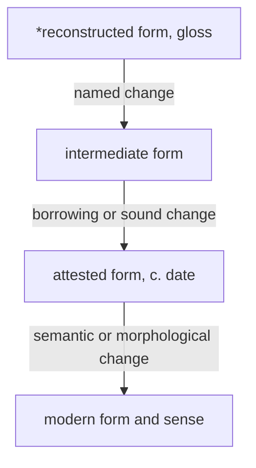

# Lexical Engineering — Deep Reference

> Working template: `assets/templates/lexical-engineering.md`
> Machine routes: `assets/domain-registry.json` · `assets/tool-catalog.json` · `assets/dependency-manifest.json` · runtime method `references/runtime-orchestration.md`
> This reference contains the domain method; its paired template carries the method through active lyric work.

## 1. Composition role

This layer constructs word fields that survive meaning, sound, register, meter, scene and performance simultaneously.

- It receives concept pressure, scene objects/actions, voice/register constraints and phonetic/prosodic targets.
- It produces ranked lexical fields, semantic anchors, etymological routes and collision candidates for rhetoric, rhyme, flow and hooks.
- The paired template keeps useful vocabulary connected to function rather than accumulating an unfiltered word list.

## 2. Core craft model

Build the word system before writing bars: a field that survives **meaning, sound, meter, register, and performance** at once.

## Deep word cloud
A useful cloud contains:
- concrete nouns;; active verbs;
- sensory properties;; relationships;
- tools and procedures;; measurements;
- consequences;; institutional/technical terms;
- local/register terms;; words with productive multiple meanings.

Group by function, not alphabetically.

## Escape the orthographic trap
Spelling produces easy suffix clusters that can sound predictable.

For a target:
1. identify the **stressed syllable**;
2. isolate the stressed vowel/nucleus and useful coda;
3. generate close matches;
4. demote an obvious same-suffix cluster if it begins choosing the sentence;
5. expand around the acoustic pivot while changing tails and word boundaries.

The original **pivot technique** survives. A universal suffix ban does not: repeated morphology can be meaningful when the repetition itself matters.

## Articulatory families
If exact rhyme is too narrow, vary by how sounds are made.

Useful exploratory moves:
- preserve the vowel, relax coda;; preserve coda shape, shift to a nearby vowel;
- substitute consonants with similar place/manner of articulation;; use consonance across different vowels;
- exploit reductions/linking in actual pronunciation.

Treat these as candidate generators. The ear and speaker decide.

## Two expansion vectors
Build outward in two directions:
1. **phonetic vector** — slant, assonance, consonance, mosaic, phrase-shape;
2. **semantic vector** — scene, action, consequence, domain, motif, relationship.

High-value words sit where the vectors intersect.

## Metrical filtering
A candidate can be a good rhyme and a bad phrase. Check:
- syllable count;; lexical stress;
- intended performed stress;; consonant congestion;
- vowel length/sustain;; word-boundary placement;
- intended beat location.

Long phrase rhymes often work because stress contour, vowel sequence, syllable timing, and phrase shape align—not because written endings match.

## Mosaic / phrase rhyme
Permit one lexical item to answer several words, or vice versa. Preserve:
- audible stressed anchors;; comparable phrase duration;
- plausible syntax;; a useful surface sentence.

Do not split phrases unnaturally just to display the mosaic on the page.

## Chain association
A chain should have **two links at every step**:
- sound relation;; semantic relation.

If a word advances only the sound chain, it is a filler risk. If it advances only the concept but destroys the established acoustic field, decide deliberately whether the break is worth it.

## Domain mining
For a technical/cultural field, extract:
- entities;; tools;
- actions;; rules;
- states;; failures;
- rankings;; measurements;
- idioms;; visual/material properties.

Then tag:
- literal fit;; legitimate second reading;
- pronunciation fit;; context accuracy;
- cliché risk.

Do not sprinkle jargon without using its real properties.

## Semantic tiers
A stable vocabulary system often mixes:
- existential/core anchors;; relational terms;
- institutional reality;; material markers;
- action verbs;; consequence vocabulary;
- signature/local terms used sparingly.

This prevents a verse becoming all slang, all objects, or all abstraction.

## Register translation
Translate **sentence systems**, not isolated slang:
- pronouns/self-reference;; word order/topicalisation;
- auxiliary deletion;; tags/discourse particles;
- intensifiers;; local verbs;
- rhythm created by syntax;; pragmatic function.

For MLE/London-sensitive work also read `voice-register.md`.

## Word archaeology: etymology as a generator, not decoration
Treat etymology, semantic change, sound laws, and derivation chains as one bounded word-archaeology method.

### Possible semantic-change mechanisms
- narrowing;; broadening;
- amelioration;; pejoration;
- metaphor;; metonymy;
- synecdoche;; ellipsis;
- antiphrasis;; auto-antonymy;
- grammaticalisation;; folk etymology;
- back-formation;; reanalysis.

These labels help generate or verify a turn; they do not make the turn good by themselves.

Use the labels precisely:

| Mechanism | Diagnostic | Compact example |
|---|---|---|
| narrowing | a broad sense contracts to a subset | *meat*: food -> animal flesh |
| broadening | a specialised sense expands | *arrive*: reach shore -> reach any destination |
| amelioration | evaluation becomes more positive | *knight*: servant -> noble warrior |
| pejoration | evaluation becomes more negative | *villain*: farm worker -> wicked person |
| metaphor | transfer by perceived similarity | physical *grasp* -> understand |
| metonymy | transfer by association/contiguity | *crown* -> monarchy |
| synecdoche | part and whole substitute | *hands* -> workers |
| ellipsis | a dropped collocate donates its sense | *private [soldier]* -> private |
| antiphrasis | use or shift toward an opposite evaluation | *wicked* -> excellent |
| auto-antonymy | contrary senses coexist | *sanction*: approve / penalise |
| grammaticalisation | content word becomes grammatical material | *going to* -> future marker |
| folk etymology | unfamiliar form reshaped toward familiar material | *cucaracha* -> cockroach |
| back-formation | a perceived affix is removed to create a word | *editor* -> edit |
| reanalysis | speakers redraw a form or boundary | Hamburg-er -> ham-burger |

### Historical relation check
If a line depends on word history:
1. verify the proposed older/current senses;
2. distinguish **inheritance** from **borrowing**;
3. identify morphology and plausible language layer;
4. check the relevant historical sound development rather than inventing a resemblance;
5. keep competing hypotheses separate;
6. preserve uncertainty;
7. ensure the modern surface sentence works without the history lesson.

Relevant diagnostics include Grimm's Law, Verner's Law, the Great Vowel Shift, i-mutation, rhotacism, French/Latin lenition, and borrowing-layer clues. Use them only when historically relevant.

Historical relatedness is **not** automatically audible rhyme.

### Language-layer diagnosis
Treat a layer as a hypothesis constrained by form, meaning, date and contact history—not a vibe.

| Candidate layer | Useful indicators |
|---|---|
| inherited Germanic | basic body/kin/nature/action vocabulary; strong-verb alternation; native `un-`, `mis-`, `-ness`, `-hood`, `-ship`, `-dom` |
| Old Norse | retained /sk/ and basic vocabulary; doublets such as *shirt/skirt*, *no/nay*, *whole/hale*, *rear/raise* |
| early Latin, pre-600 | trade/domestic terms shared across West Germanic: street, wall, wine, cheese, mile, pound |
| Christianisation Latin, c. 597-1066 | religion, education and letters: bishop, monk, school, angel |
| Anglo-Norman, c. 1066-1250 | law, rule, war and cuisine; `w/g`, `k/ch` and `ch/sh` doublet patterns such as warden/guardian or catch/chase |
| Central French, c. 1250-1500 | culture, fashion and abstract vocabulary; palatalised forms and later French doublets |
| Renaissance Latin/Greek, c. 1500-1650 | learned science/philosophy/medicine; visibly retained `-tion`, `-ity`, `-ous`, Greek combining forms |
| mixed/polygenetic | French and Latin both fit the English outcome; preserve both routes with separate confidence rather than forcing one parent |

### Sound-law tests
Apply a law only across the stages and language branch it actually governs.

| Process | Operational correspondence | What it can diagnose |
|---|---|---|
| Grimm's Law | PIE `p/t/k` -> Germanic `f/th/h`; `b/d/g` -> `p/t/k`; aspirates -> voiced stops/fricatives | inherited Germanic correspondences such as father/pater or three/tres |
| Verner's Law | a Grimm fricative voices when inherited accent was not immediately before it | apparent Grimm exceptions and alternations such as was/were |
| Great Vowel Shift | English long vowels raise; highest vowels diphthongise | modern spelling/pronunciation divergence: mice, house, meet, food, name |
| i-mutation | a following historical /i/ or /j/ fronts the preceding vowel | man/men, foot/feet, goose/geese, fall/fell |
| Ingvaeonic nasal spirant law | nasal loss before voiceless fricative plus vowel lengthening | English mouth/five/goose against German Mund/fünf/Gans |
| rhotacism | inherited intervocalic `s/z` becomes `r` in relevant paradigms | was/were and other irregular alternations |
| Latin-to-French lenition | intervocalic stops voice, fricativise or disappear | why French loans can diverge sharply from their Latin forms |
| High German consonant shift | German `p -> pf/ff`, `t -> ts/ss`, `k -> ch` where English retains the earlier stop | recognising English/German cognates such as apple/Apfel or water/Wasser |
| West Germanic gemination | consonants double before historical /j/ | inherited forms where a lost conditioning segment explains the consonant |

For Great Vowel Shift work, test the specific long-vowel path rather than citing the label generically: `/iː/ -> /aɪ/`, `/uː/ -> /aʊ/`, `/eː, ɛː/ -> /iː/`, `/oː/ -> /uː/`, `/ɔː/ -> /oʊ/`, `/aː/ -> /eɪ/`. For Verner's Law, the older voicing path is conventionally represented `f -> β`, `þ -> ð`, `h -> γ`, `s -> z` before later developments.

### Morphology and formation history
Separate productive English morphology from structure inherited inside a loan.

- Native inventory: `un- mis- be- fore- over- out- under- with-` and `-ness -dom -ful -less -ish -ly -hood -ship -ward -wise -like`.
- Latin/French inventory: `re- dis- pre- pro- de- ex- in-/im- sub- super- trans- inter- anti-` and `-tion/-sion -ment -able/-ible -ous -ive -al -ity -ence/-ance -ure`.
- Greek combining inventory: `auto- bio- geo- hyper- hypo- micro- macro- mono- neo- poly- pseudo- tele-` and `-ology -graph -scope -phobia -mania -ism -ist`.
- Before splitting a word, ask whether it was borrowed whole, whether the apparent base existed independently with the required sense, and whether the derivation occurred in English. A later back-formation is not the source of its parent.
- Preserve cranberry morphemes as historically opaque residue rather than inventing a modern meaning: *cran-* in cranberry, *-kempt* in unkempt, *hap-* in hapless, *-couth* in uncouth.

### Derivation-chain discipline
For complex wordplay, sketch:
`source form -> sound/morphological change -> intermediate sense -> modern sense -> lyric use`

Branch when there are cognates/learned borrowings. Mark competing hypotheses instead of forcing one clean ancestry. For cross-family travelling words, treat the borrowing route as a network rather than pretending direct inheritance.

For a readable Mermaid derivation artifact:
- use `graph TD` for one chain and `graph LR` for comparison or travelling borrowings;
- write nodes as `ID["form, short gloss, attestation when known"]`;
- mark reconstructed forms with `*`;
- label edges with the sound law, borrowing route, morphological operation or semantic shift;
- use solid arrows for established steps and dotted arrows for uncertain hypotheses;
- branch cognates, learned borrowings and genuinely competing proposals instead of merging them;
- keep labels concise and normal depth near six or seven nodes.

Record the chain, branches, uncertainty, and intended lyric use in `assets/templates/lexical-engineering.md`.

## Entendre mining
Strong routes:
- polysemy;; homophony/near-homophony;
- reanalysis of word boundaries;; legitimate cross-domain terminology;
- historical/semantic change when verified.

For every route use the **surface-first rule**: the literal reading must work independently.

## Pre-write target
Aim for:
- 3–4 anchor sounds;; several tail patterns per family;
- one primary semantic field;; one contrast/collision field;
- motif-capable terms;; an explicit reject list of cliché/forced landings.

Record the anchor sounds, tail patterns, semantic fields, and reject list in `assets/templates/lexical-engineering.md`.

## Executable lexical surfaces

The word cloud is not merely a prewriting page. It can be measured and compared.

`lexical_cloud.py` can expose:
- term frequency;; type/token ratio;
- normalized frequency entropy;; recurring bigrams;
- draft-to-draft frequency deltas;; an optional monochrome PNG.

Questions:
- is one abstract noun doing too much work?; did revision accidentally remove the concrete field?
- has the hook's anchor disappeared from the verse?; did imported slang overwhelm the speaker's existing syntax?
- did a motif develop or merely repeat?

Frequency does not equal importance. A single rare word can be the song's centre.

---

## Functional register engineering

For local varieties such as MLE, do not treat vocabulary as stickers.

Track:
- pronoun/self-reference system;; topicalisation;
- auxiliary deletion;; tag questions;
- discourse particles;; action verbs;
- relational terms;; institutional vocabulary;
- euphemistic mappings;; code-switch conditions.

A register switch is meaningful when audience, power relation, emotional distance or institutional setting changes.

The lexical engine should therefore return to **function**:
“What social job does this word/syntax perform here?”

---

## Word history as a generative route

Etymology is most useful when it exposes an actual semantic relation.

Potential mechanisms:
- narrowing/broadening;; amelioration/pejoration;
- metaphor;; metonymy;
- synecdoche;; grammaticalisation;
- inherited/borrowed doublets;; morphology that remains semantically active.

Do not manufacture false etymologies from modern-looking word parts. If historical origin matters, research it. The craft move is to exploit a verified historical shift or structural relationship, not merely mention one.

## 4. Decision method

### 4.1. Frame
- Name the section function, hard constraints, and the complete set of craft objectives and questions; record them in `assets/templates/lexical-engineering.md`.

### 4.2. Baseline
- Describe the present behaviour before judging it; Record the decision in `assets/templates/lexical-engineering.md`.

### 4.3. Hinge
- Identify the full set of words, bars, events, and performance moments involved in the binding issue.
- Record the decision in `assets/templates/lexical-engineering.md`.

### 4.4. Mechanism
- Explain how the suspected variable creates the observed effect; Record the decision in `assets/templates/lexical-engineering.md`.

### 4.5. Isolate
- For causal comparison, hold strong dimensions fixed while varying each suspected lever separately; then combine every improvement that survives its isolated test and record the results in `assets/templates/lexical-engineering.md`.

### 4.6. Material and tool support
- Ground the decision in supplied creative material, direct reading or rehearsal, and every relevant representation, detector or generator.
- Record the decision in `assets/templates/lexical-engineering.md`.

### 4.7. Audition
- Compare baseline and candidate in the medium that matters; Record the decision in `assets/templates/lexical-engineering.md`.

### 4.8. Collateral
- Check meaning, voice, rhyme, rhythm, performance, sequence, and consequence as relevant.
- Record the decision in `assets/templates/lexical-engineering.md`.

### 4.9. Commit
- Keep the most effective change set that survives audition without analytical explanation; Record the decision in `assets/templates/lexical-engineering.md`.

### 4.10. Handoff
- Pass observations, locked decisions, open questions, and generated candidates into every connected domain that can use them.
- Record the decision in `assets/templates/lexical-engineering.md`.

## 5. Working variables

- **Concrete Nouns** · **Active Verbs**
- **Sensory Properties**
- **Procedural Vocabulary**
- **Institutional Language**
- **Technical Terms** · **Local Register**
- **Semantic Anchors** · **Polysemy**
- **Word History** · **Morphology**
- **Sound Family** · **Stress Contour**
- **Motif Vocabulary**
- **Counter-Field Vocabulary**
- **Consequence Words**

## 6. Template contract

- Use `assets/templates/lexical-engineering.md` for working state, not this reference.
- Fill every field relevant to the task; keep baseline and candidate visible together.
- Anchor the decision to exact lines, bars or timestamps; fill from supplied material, direct observation, rehearsal, or verified context, and keep genuine unknowns blank.
- Log tool id, input scope, output limit, and accepted/rejected implication; Record seed and locked dimensions for generative operations.
- Update the template whenever rehearsal or a new observation disproves the current working model.

## 7. Script routes — preflight each listed tool with `python scripts/tool_router.py --tool <id>` before execution

### Primary
- `lexical_cloud` → `scripts/lexical_cloud.py`
  - Contribution: vocabulary concentration, motif frequency or revision delta.
  - Class: `detection`.
- `semantic_field_map` → `scripts/semantic_field_map.py`
  - Contribution: maps field distribution, line progression and cross-field collisions; the `uk-drill` preset is opt-in.
  - Class: `detection`.
- Feed active and unmapped fields into concept, scene and rhetoric; never treat a field count as thematic importance.
- `rhyme_suggester` → `scripts/rhyme_suggester.py`
  - Contribution: phonetic/slant rhyme candidates without committing to meaning.
  - Class: `generation`.
- `phoneme_map` → `scripts/phoneme_map.py`
  - Contribution: maps pronunciation, stress, syllable structure and rhyme material.
  - Class: `representation`.
### Secondary
- `word_rearranger` → `scripts/word_rearranger.py`
  - Contribution: reorders supplied words and clauses to test syntax, emphasis and landing.
  - Class: `transform`.

### Tool-class boundaries
- Representation keeps supplied material beside labelled derived structure; detectors map concrete conditions and opportunities with locations and confidence.
- Generators and transforms create controlled candidates; evaluation combines mechanical observations with close reading, audition and comparison.
- Support checks runtime/package state, not craft quality.

## 8. Cross-file handoffs

- `references/rhyme-phonology.md` ↔ `assets/templates/rhyme-phonology.md`
- `references/voice-register.md` ↔ `assets/templates/voice-register.md`
- `references/context-research.md` ↔ `assets/templates/context-research.md`
- `references/rhetoric-impact.md` ↔ `assets/templates/rhetoric-impact.md`
- `references/revision-evaluation.md` ↔ `assets/templates/revision-evaluation.md`
- `references/revision-evaluation.md` once the task becomes comparative revision.

## 9. Failure modes

Repair the named craft variable, audition the result, and recheck every layer it changes.

### Alphabetical word dumping

### Suffix-family predictability

### Thesaurus diction

### Unverified etymology

### Generic authenticity markers

### Register leakage

### Semantic field too broad

### Sound-first word choice with weak meaning

### Technical terminology used decoratively

### Lexical novelty that cannot be performed

## 10. Completion

- [ ] Question is explicit and bounded.
- [ ] User constraints remain visible.
- [ ] Observation, inference, and choice are distinct.
- [ ] Template captures every task-relevant working variable and cross-domain handoff.
- [ ] Any tool matched its catalog condition.
- [ ] Estimates and uncertainty are labelled.
- [ ] Generation and selection were separated.
- [ ] Strong existing properties were preserved.
- [ ] Cross-domain side effects were checked.
- [ ] Output survives audition without the analysis.

## 11. Topology

- Template: `assets/templates/lexical-engineering.md`; Domain index: `assets/domain-registry.json`
- Tool index: `assets/tool-catalog.json`; Composition matrix: `assets/composition-matrix.md`
- Validator: `scripts/validate_domain_architecture.py`; Router: `SKILL.md`
